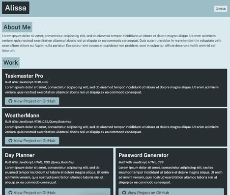

# portfolio-generator

## Description
This portfolio-generator will prompt the user in the CLI with a series of questions: what is your name, do you want to include a bio, what is the name and link to your project, etc. Once the questions have been answered, this program will generate a fully styled webpage (via providing css and html files) ready to deploy!

To use this program, you will need to clone this repo to your local directory, and then execute by typing "node app.js" in the CLI once inside your local directory where this was stored.

## Screenshot

## Built With
* CSS
* JavaScript
* Node.js

## Credits
UCF - Boot Camp Spot